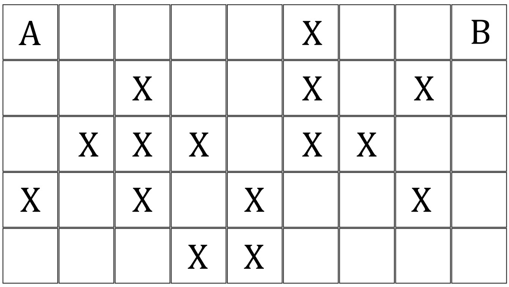
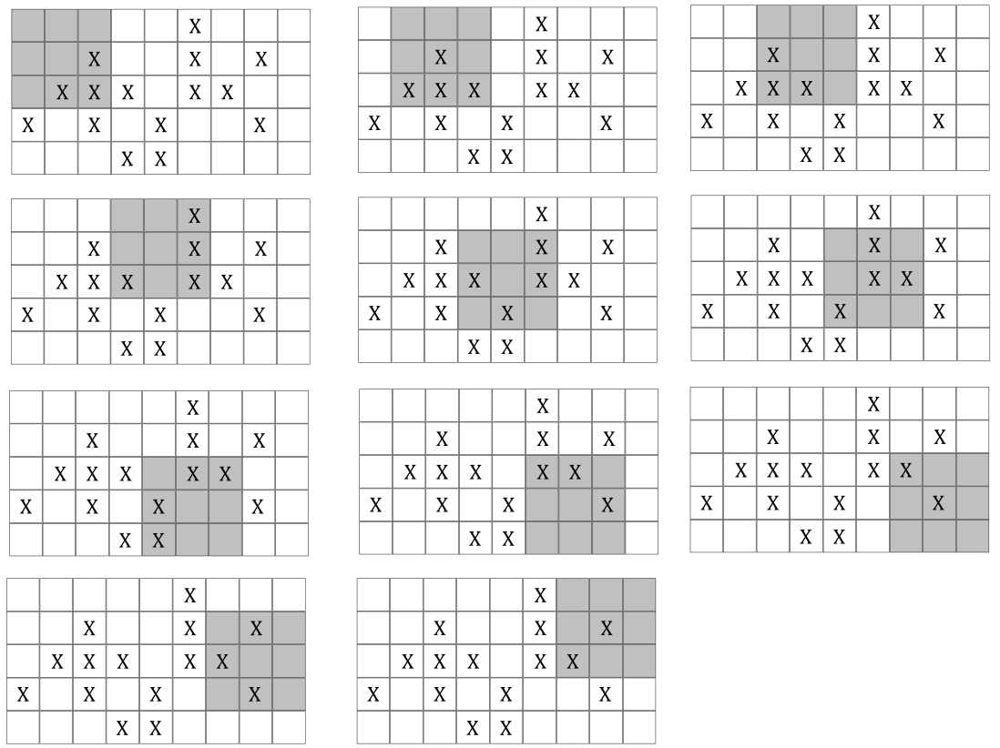

Krišjānis ir uzkonstruējis kvadrātveida putekļsūcēju (saīsināti – KP), kas ir neaizstājams palīgs viņa darbnīcas uzkopšanā. KP atmiņā darbnīcas grīda tiek attēlota kā $N \times M$ rūtiņu laukums, kurā pats KP aizņem $K \times K$ rūtiņas. Laukumā dažas rūtiņas var būt bīstamas (netērēsim laiku, mēģinot noskaidrot, ko tieši tas nozīmē), un KP nekad nedrīkst nonākt situācijā, ka KP atrašanās vietā vairāk nekā puse tā noklāto rūtiņu ir bīstamas. Ir zināma KP sākotnējā atrašanās vieta un īpaša rūtiņa, kura noteikti jāuzkopj, t.i., KP jāuzbrauc uz tās. Vienā solī KP var pārvietoties par vienu rūtiņu horizontālā vai vertikālā virzienā, neizejot no laukuma robežām. Nepieciešams noteikt, ar kādu mazāko soļu skaitu KP var nonākt situācijā, ka tas uzkopj īpašo rūtiņu.

Piemēram, 1. attēlā parādītajā kartē $N = 5$, $M = 9$, $K = 3$ ar „A“ apzīmēta KP sākotnējās atrašanās vietas kreisā augšējā rūtiņa, bet ar „B“ – īpašā rūtiņa. Bīstamās rūtiņas apzīmētas ar „X“.

Šajā gadījumā īpašo rūtiņu iespējams uzkopt ātrākais 10 soļos, veicot 2. attēlā parādīto maršrutu.

Uzrakstiet datorprogrammu, kas dotam laukuma aprakstam nosaka, ar kādu mazāko soļu skaitu KP no sākuma pozīcijas var nonākt līdz īpašās rūtiņas uzkopšanai!

---

Ievaddatu pirmajā rindā dotas trīs naturālu skaitļu – laukuma rindu skaits $N$ $(2 \leq N)$, laukuma kolonnu skaits $M$ $(2 \leq M)$ un KP malas garums rūtiņās $K$ $(1 \leq K \leq \min(N, M))$. Tiek garantēts, ka $N \cdot M \leq 10^6$. Starp katriem diviem blakus skaitļiem ievaddatos ir tukšumzīme.

Nākamajās $N$ ievaddatu rindās dots laukuma apraksts. Katrā rindā ir tieši $M$ simboli un katram $i$ $(1 \leq i \leq N)$ un $j$ $(1 \leq j \leq M)$ simbols ievaddatu $(i + 1)$-ās rindas $j$-tajā kolonnā atbilst laukuma $i$-tās rindas $j$-tās kolonnas rūtiņas saturam un var būt:

- `.` - parasta rūtiņa
- `X` - bīstama rūtiņa
- `A` - KP sākuma atrašanās vietas kreisā augšējā stūra rūtiņa. Šī vienmēr ir parasta rūtiņa un uzdota korekti – t.i., KP pilnībā ietilpst laukumā.
- `B` - īpašā rūtiņa. Šī vienmēr ir parasta rūtiņa.

---

Izvaddatu vienīgajā rindā jābūt veselam skaitlim – mazākajam soļu skaitam, kas ļauj no sākuma pozīcijas nonākt līdz īpašās rūtiņas uzkopšanai, vai -1, ja derīgs maršruts neeksistē. Īpašā rūtiņa ir uzkopta tad, ja KP nonāk pozīcijā, kur tas noklāj īpašo rūtiņu. Ievērojiet, ka nekādi nav noteikts, kurai KP rūtiņai uzkopšanas brīdī jāatbilst īpašajai rūtiņai!

